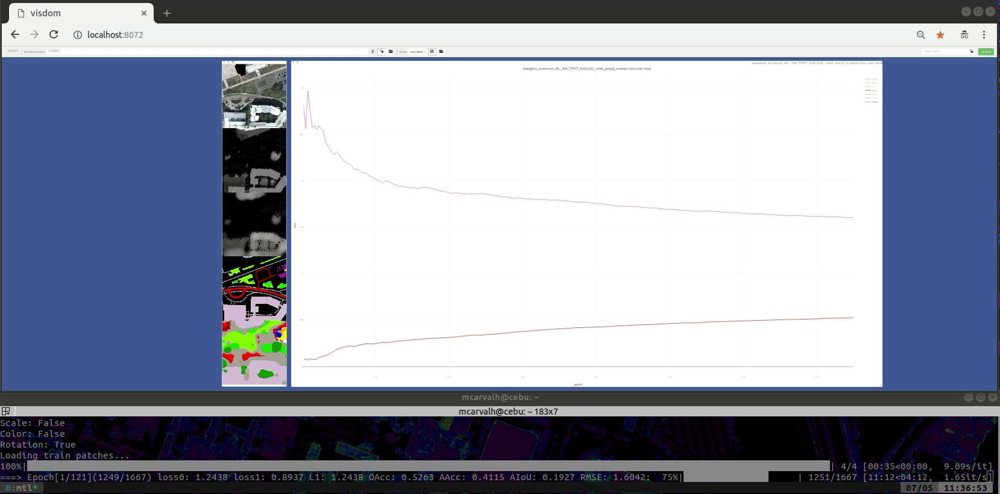

# Multi-Task Learning for Aerial Images

PyTorch implementation for aerial images for the datasets: [IEEE Data Fusion Contest 2018 (DFC2018)](http://www.grss-ieee.org/community/technical-committees/data-fusion/2018-ieee-grss-data-fusion-contest-results/) and [ISPRS-Vaihingen](http://www2.isprs.org/commissions/comm3/wg4/2d-sem-label-vaihingen.html).


### Prerequisites

We suggest using Python 3.7 or higher. To run this code and visualize plots and training intermediate results with Visdom, you will need the following packages (you may check file [pre_install.sh](./config/pre_install.sh) for more details):

* [PyTorch](https://pytorch.org/get-started/locally/): Open source deep learning platform. Version 1.0 or higher
* [Visdom](https://github.com/facebookresearch/visdom): Framework for data visualization. 
* [Rasterio](https://rasterio.readthedocs.io/en/latest/installation.html): Reads and writes files with geographic information (GeoTIFF and others) and provides a Python API based on Numpy :dimensional arrays and GeoJSON.
* [Geopandas](http://geopandas.org/): Open source project to make working with geospatial data in python easier.
* [Libiconv](https://anaconda.org/cond:forge/libiconv): Provides iconv for systems which don't have one.
* [TQDM](https://github.com/tqdm/tqdm): Progress bar for Python.

### Installing

Download/Fork/Clone this repository to your server or computer.

### Datasets

Download one or both datasets to start training/inference with this code. Our scripts expect the datasets to be placed in [datasets](./datasets).

* [DFC 2018](http://www.grss-ieee.org/community/technical-committees/data-fusion/2018-ieee-grss-data-fusion-contest-results/): collection of multi-source optical imagery over Houston, Texas. In particular, it contains Very High Resolution (VHR) color images resampled at 5cm / pixel, hyperspectral images and LiDAR-derived products such as DSMs and Digital Elevation Models (DEMs) at a resolution of 50cm / pixel.
* [ISPRS-Vaihingen](http://www2.isprs.org/commissions/comm3/wg4/2d-sem-label-vaihingen.html): comprises IRRG (Infra-
Red, Red and Green) images at 9cm / pixel, DSM and 2D and 3D semantic labeled maps for urban classification and 3D reconstruction.


## Running

First, run an instance of Visdom and choose the desired port to publish results (8001 in our example):

```
$ visdom -port 8001
```

We've prepared several scripts to run our experiments in [std_scripts](./std_scripts). For example, to run a training routine on DFC2018, in the main root, run:

```
$ sh std_scripts/grss_dfc/grss_train.sh 0 8001 1 eweights
```

Code will expect a cuda device available with ID 0, Visdom running on 8001 and the multi-task learning method will be performed with uniform weighting. Check file to know standard parameters used.



## License

Code (scripts) are released under the GPLv3 license for non-commercial and research purposes only. For commercial purposes, please contact the authors.

## Acknowledgments

* Hat tip to anyone whose code was used
* Inspiration
* etc
